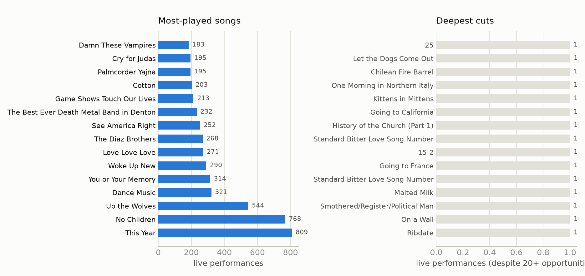
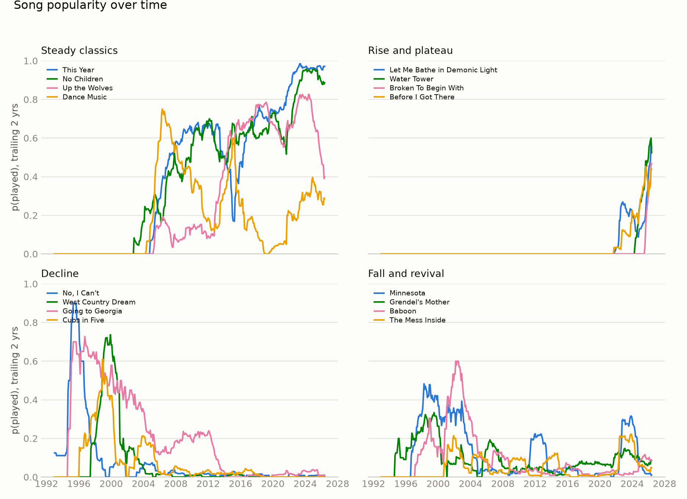
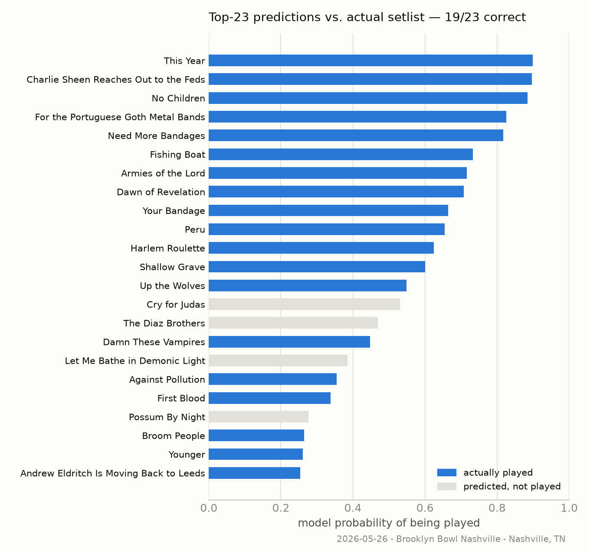
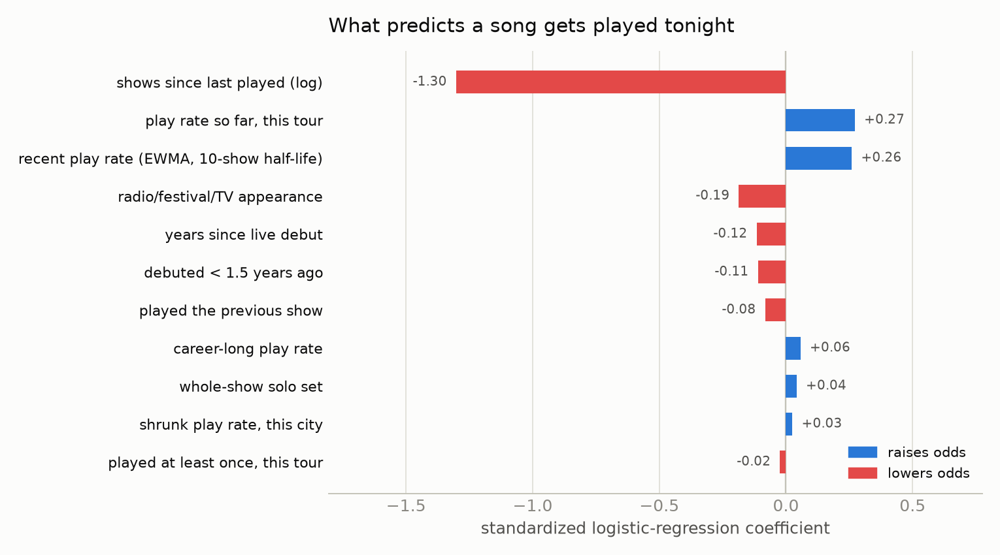
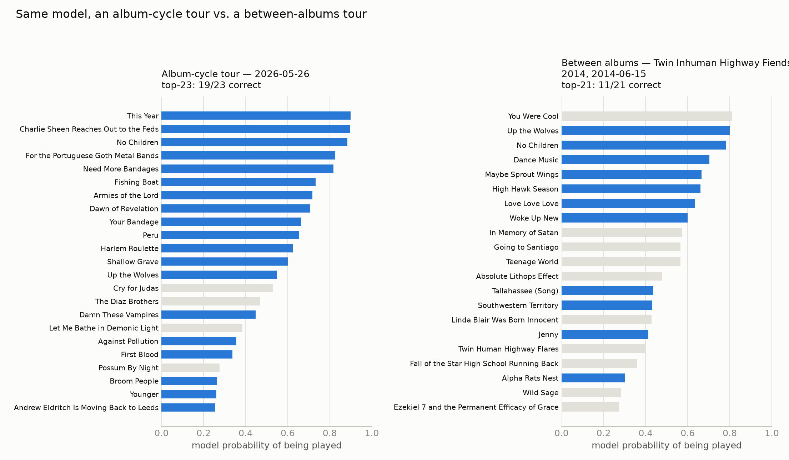
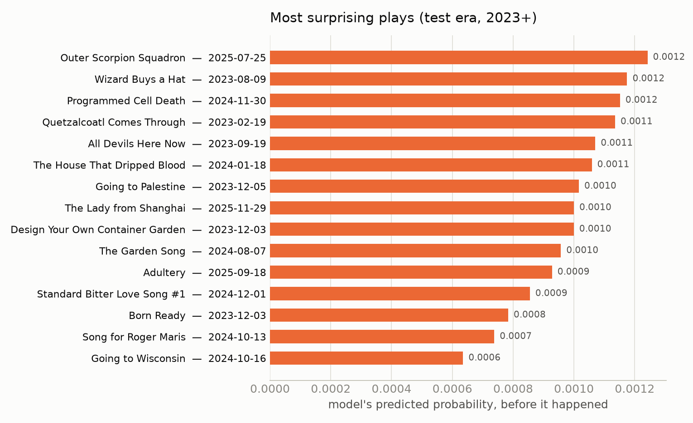
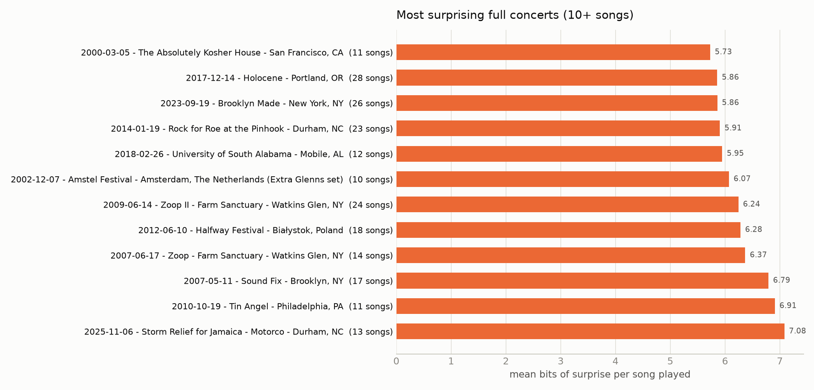
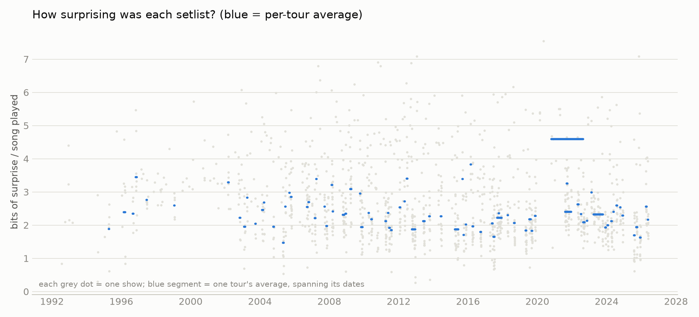
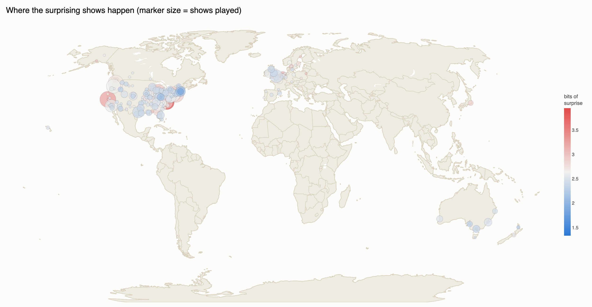
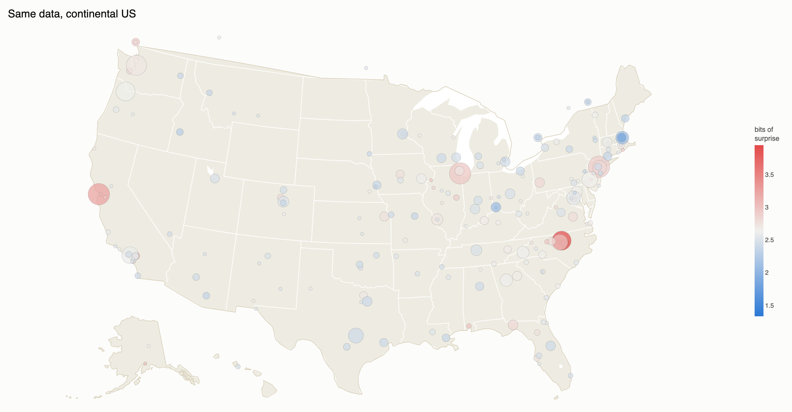

# The Mountain Goats, Every Night: Scraping and Modeling 34 Years of Setlists

*A data project built on [themountaingoats.fandom.com](https://themountaingoats.fandom.com/wiki/Category:Live_Shows), the fan-run wiki documenting (nearly) every Mountain Goats live show.*

## The dataset

The wiki lists 1,579 live shows from 1992-05-31 through 2026-05-26 — solo John
Darnielle sets, full-band tours, radio sessions, festival slots, and Extra
Glenns/Extra Lens side-project shows. 1,317 of those have a documented
setlist: 22,699 individual song performances across 845 distinct songs,
spanning 97 named tours. 1,739 performances have at least one linked
YouTube/Vimeo video.

Getting from "a wiki category page" to those numbers took a few real fixes:

- **Tour isn't in the page text — it's a wiki category** (e.g. `Peter Hughes
  Farewell Tour 2024`). Two earlier scraper attempts both missed this and
  scraped `tour: null` for every show.
- **Encores aren't marked in the setlist table.** They're stated in prose
  in the Notes section — *"The encore was songs 19 through 23"* — referencing
  the table's printed order numbers. A small parser turns ~30 recurring
  phrasings of that sentence into a per-song encore number.
- **Song identity needed real normalization.** The wiki links each song to
  its own page, but the same song shows up under underscore-joined slugs,
  space-joined display text, and case variants of both (`Southwood_Plantation_Road`
  vs. `Southwood Plantation Road`, `Broken To Begin With` vs. `Broken to
  Begin With`). Left unmerged, this silently splits a song's play count
  across multiple rows — a real bug caught mid-project, where "Southwood
  Plantation Road" initially showed 1 play instead of its real count, 165.
- **Covers needed their own source of truth.** Sniffing setlist notes for
  the word "cover" only catches about a dozen of them — the wiki actually
  maintains its own `Category:Covers`, which tags 156 of the songs played
  live here (Thin Lizzy, Bowie, Fall Out Boy, and 153 others). Every song
  and performance carries an `is_cover` flag from that category, and the
  prediction model excludes covers from its candidate universe entirely —
  a Thin Lizzy cover played once isn't a "deep cut" in the same sense a
  rarely-played original is.
- **A disambiguated title quietly duplicated as its own "note."** 20 songs
  have their own wiki page distinct from a same-named album (`Tallahassee
  (Song)` vs. the album `Tallahassee`); the setlist link's visible text is
  just `Tallahassee`, but its `title=` attribute is the disambiguated
  `Tallahassee (Song)`. The note-cleanup step was stripping the *resolved*
  title from the raw cell text instead of what was actually there, so the
  plain link text was left stranded as a bogus note on every performance of
  all 20 songs (hundreds of rows read as `note: "Tallahassee"` for no
  reason). Fixed by stripping what's actually in the raw text, not the
  resolved title.

The pipeline is two-stage: `fetch` downloads and locally caches every wiki
page via the MediaWiki API (resumable, and incremental on later runs — it
only re-fetches pages whose revision id changed), and `build` parses the
cached HTML into `shows.csv` / `performances.csv` / `songs.csv` entirely
offline. Re-running `fetch` after a new tour is a few-minute job.

## What gets played, and what doesn't



"This Year" and "No Children" anchor the top of the list — both a majority
of all shows since they entered rotation. The deep-cuts panel isn't just
"least played ever" (most of the 845 songs have only 1–2 plays and aren't
interesting on their own); it's the bottom of an **opportunity-adjusted,
shrinkage-smoothed play rate** among songs that have had at least 20 chances
to be played since their live debut — so a song is only called a deep cut if
it's been consistently passed over, not just recently written. Full
methodology in [docs/deep_cut_notes.md](docs/deep_cut_notes.md); results in
[analysis/song_stats.csv](analysis/song_stats.csv).

## Song popularity over time

Treating each song's live history like a word's frequency in Google Ngrams —
a trailing 2-year play rate sampled monthly — turns 34 years of setlists into
trajectories: songs sit at zero before they're written, rise as they enter
rotation, plateau, decline, and sometimes come back.



These four groups were picked automatically from the computed trajectories,
not hand-selected: the four most-played songs overall (*steady classics*);
songs that debuted in the back half of the catalog's history and have
climbed straight into rotation since (*rise and plateau* — this is the
"allele sweep" pattern, a song appearing from nothing and taking hold); the
biggest gap between early-career peak and recent play rate (*decline*); and
songs with a real trough between two active periods (*fall and revival*).

The decline panel caught something the wiki itself corroborates: **"Going to
Georgia"** was a fixture through the mid-2000s, then drops off hard — a 2012
show note has John Darnielle explaining, mid-show, that he considers it a
"bullshit song" with an "asshole" narrator and doesn't want to play it
again. The data shows the falloff independent of that anecdote; the anecdote
just explains it.

## Predicting the setlist

Framed as one binary outcome per (show, song) pair — is this the night song
X gets played? — every one of the 1,310 dated, setlisted shows becomes a
training example, using only information available *before* that show:
how recently and how often the song's been played, how it's fared on the
current tour, its age, and whether it's a shortened-set special appearance
(radio/festival/TV). Full feature list and code in
[predict.py](predict.py).

A logistic regression on those features is compared against a simple but
strong baseline — an exponentially-decayed play rate alone — on a strict
temporal split (train through 2022, test on the 207 shows from 2023
onward, so nothing in the test set could leak backward into training):

| model | log-loss | Brier score | top-*n* setlist recovery |
|---|---|---|---|
| Baseline (decayed play rate) | 0.0822 | 0.0195 | 51.1% |
| Logistic regression | **0.0673** | **0.0167** | **59.4%** |

*Top-*n* setlist recovery*: for each show, take the model's *n* highest-probability
songs, where *n* is the actual number of songs played that night, and measure
what fraction were right. On the most recent show in the data:



### What actually predicts a setlist



Recency dominates everything else combined — if a song was played a few
shows ago, it's overwhelmingly likely to come back soon; if it's been a
while, it's overwhelmingly likely to sit out. That's the visible mechanism
behind the tour "rotation": John Darnielle appears to work from a
live pool of songs and cycle through it rather than drawing independently
from the whole catalog each night, which is exactly what `tour_rate`
(how often a song's been played *this tour specifically*) picking up a real,
independent signal on top of recency confirms. Two smaller and genuinely
interesting effects: conditional on recency, brand-new material is actually
*less* sticky than catalog average (album-cycle songs burn hot then get
rotated out faster than an old favorite would), and radio/festival/TV
appearances reliably favor hits over deep cuts, as you'd expect from a
shorter set. Two more recent additions, both real but modest: a whole-show
solo set (`is_solo`, conservatively flagged — see caveats) slightly raises
a song's odds, and a shrunk city-level play rate (`city_song_rate` — see
[Does geography matter?](#does-geography-matter) below) picks up a small
independent "local favorite" effect on top of everything else.

### Is this just tracking album hype?

The 2026 example above is a new-album tour, and `new_material` is a real
feature in the model — worth checking whether the strong recovery number is
mostly "predict whatever's newest" in disguise. To test that, I picked a
tour the model never got to see labeled as an album cycle: among all 2014
tours with at least 8 shows, the one whose *actually-played* songs had the
lowest share of new material — automatically, not by hand — is the **Twin
Inhuman Highway Fiends Tour 2014**, squarely in the two-and-a-half-year gap
between *Transcendental Youth* (2012) and *Beat the Champ* (2015):



The between-albums tour is visibly *harder* to predict — 55.1% top-*n*
recovery tour-wide, versus 59.4% for the full 2023+ test era — despite 2014
being in-sample (the model trained on it directly, which should make it
look artificially *easier*, not harder). That's a reasonable answer: without
a record to promote, the setlist draws more evenly across a wider pool of
similarly-loved catalog songs, so there's genuinely more entropy to predict,
not less. The model isn't just riding hype; if anything, album cycles are
the *easy* case, because they concentrate probability mass onto a
predictable set of newly-written songs.

### When the model gets surprised

The flip side of a good model is a good list of its misses — nights the
model gave a song almost no chance, and it got played anyway:



These are basically a machine-generated "rarities and one-offs" list:
songs that came back from years of dormancy for a single night, often at a
show with some specific occasion (last night of a tour leg, a hometown show,
a request). [analysis/surprising_plays.csv](analysis/surprising_plays.csv)
has the full ranked list if you want to go looking for what made those
nights special.

### Most surprising *concerts*

Individual surprising plays are one thing; whole surprising *concerts* are
a different question, and a more interesting one — which nights, top to
bottom, most defied the rotation? Averaging each song's pre-show surprisal
across a whole setlist answers this directly, though a 1-song guest cameo
would trivially top the list (no averaging-out across a full set), so this
is filtered to real setlists (10+ songs):



These aren't random — they cluster hard around **benefit shows, festivals,
and untoured one-offs**: a Hurricane Jamaica relief show, a "Rock for Roe"
benefit, Merge Records' 35th-anniversary show, farm-sanctuary benefit gigs,
European festival slots. Special-occasion shows pull deep cuts and
one-time pairings that the regular tour rotation wouldn't produce — which
is exactly the kind of thing this metric should catch, and does. Full
ranked list in
[analysis/most_surprising_concerts.csv](analysis/most_surprising_concerts.csv).

### How surprising was each *setlist* as a whole?

The plays above are the most surprising individual songs; zooming out, the
same pre-show probabilities give a surprise score for an entire night's
setlist — the average bits of information (−log₂ *p*) across the songs
actually played, using only what the model knew walking in. Low = a
thoroughly expected set; high = a night that defied the rotation:



Touring is bursty — weeks of shows, then months of silence — so this is
aggregated per tour (the natural unit) rather than smoothed over a fixed
show-count window, which would saw up and down at tour boundaries. The
tours with the highest average surprise are almost all **solo, stripped-down
tours** — Winter Solo Tour 2024, the Ghost Cave Incubation Chamber solo
non-tour, All Roads Lead to Lincoln Solo Mini-Tour — which makes sense: a
solo acoustic set draws from a noticeably different, more idiosyncratic pool
than a full-band show. This is what motivated adding `is_solo` to the
model (see above) — but its coefficient came back small, meaning a whole
show's worth of unpredictability isn't fully explained by "solo" alone;
something about *which* songs a solo set draws on is still outside what
the model sees. Full per-show numbers in
[analysis/show_surprisal.csv](analysis/show_surprisal.csv), per-tour
rollups in [analysis/tour_surprisal.csv](analysis/tour_surprisal.csv), and
every show's surprise score is browsable live in the
[webapp](webapp/index.html)'s Show Browser tab.

### Does geography matter?

Two different questions hide inside "does geography matter," and they get
different treatments. **Where does JD play what** — is `city_song_rate`, a
feature that's already inside the prediction model above, learning
genuinely predictable local patterns (a song that runs hot in one city
specifically). **How surprising is a place, even after the model's best
effort** is a different question — the residual left over once prediction
has already used everything it knows, including geography. That residual
is computed once per show and never revisited (`show_surprisal.csv`,
described earlier, is final — nothing below touches it). What *can*
legitimately be adjusted is how individual shows get **aggregated into a
per-city summary**, since a two-show average is mostly noise. That's an
estimation problem, and it's where the rest of this section lives.

A live-music instinct worth checking: some cities feel like they get
*better*, weirder, more surprising shows — San Francisco, in particular.
City-level data is thin (312 distinct cities, median 2 shows each), so a
raw average is dominated by noise almost everywhere. Each city's mean is
empirical-Bayes shrunk toward a prior, weighted by how much history it
actually has (`shrunk = (n·raw_mean + k·prior) / (n + k)`, k = 8
equivalent shows). The *ranking* below is restricted to places with at
least 3 shows — without that filter, a single wildly-surprising night in
a 1-show town can technically out-rank a robust 57-show estimate, since a
thin sample leans almost entirely on its prior; that's comparing against
noise, not a meaningful result (an earlier, unfiltered version of this
analysis made exactly that mistake).

The prior each city shrinks toward matters. Administrative boundaries are
a poor proxy for "shared local scene": pooling every city in North
Carolina together, say, would let a random small town 150 miles from
Durham "borrow" Durham's specialness just because it shares a state line,
while genuinely-adjacent cities on opposite sides of a state border
(Kansas City, KS/MO) would share nothing. The right unit is actual
geographic proximity — cities within **25 km** of each other (measured
directly from real coordinates via DBSCAN + haversine distance) are
pooled as one metro scene; anywhere with no real neighbor in the tour
history stays fully on its own, shrinking straight to the global mean and
weighted only by its own sample size. That deliberately conservative
radius favors *under*-grouping: Boston/Cambridge/Somerville and
Durham/Chapel Hill/Carrboro/Cary/Raleigh cluster (they're a few miles
apart), but a satellite town 20-40 miles out keeps its own signal rather
than getting smeared into a regional average built mostly from other
places.




**San Francisco checks out**: clustered with Oakland into a Bay Area
scene (58 shows, 3.18 prior), SF's own 57-show, 3.28-raw average shrinks
to 3.27 — barely moved, its own sample is strong enough to dominate —
ranking **5th of 125** places with a real sample. But it's not even the
strongest signal in the data: **Durham, NC is #1** (clustered with Chapel
Hill/Carrboro/Cary/Raleigh, 30 shows, 3.95 shrunk bits) — that's John
Darnielle's home turf, and it tracks: hometown shows disproportionately
include benefit gigs, record-release shows, and extended sets, the same
kind of occasion that dominates the [most-surprising-concerts
list](#most-surprising-concerts) above. Notably, **Pittsboro, NC ranks
#4 on its own** (5 shows, 3.39 bits) — close to Durham but far enough
(>25km) to have no real neighbor in the tour history, so it correctly
keeps its own distinct signal rather than inheriting Durham's. Same
story for **#2, Watkins Glen, NY** (4 shows, 3.65 bits): all four are the
"Zoop"/"Zoop II" Farm Sanctuary benefit concerts, a genuinely different
kind of show from anything else in upstate New York, and pooling it with
distant NY cities would have erased exactly what makes it a real outlier.
Full rankings in [analysis/city_surprisal.csv](analysis/city_surprisal.csv)
(city-level, `shrunk_mean_bits`) and
[analysis/metro_surprisal.csv](analysis/metro_surprisal.csv) (the metro
clusters themselves, with member lists).

Given that finding, `city_song_rate` earns its place in the prediction
model above — a shrunk, causally-computed "does this song run hot in this
city" rate feeds directly into the per-song predictions, not just this
descriptive analysis. Its coefficient is real but small (+0.02 standardized,
vs. −1.30 for recency), meaning local-favorite effects exist but are a
minor correction on top of tour rotation, not a dominant force.

Cities are geocoded against an offline database
([geocode_cities.py](geocode_cities.py)), matched by exact name (after
normalizing case/diacritics/abbreviations) — deliberately **not** a fuzzy
or nearest-match: an earlier version fell back to "the biggest city in the
state" for anything without an exact hit, which silently produced *wrong*
coordinates (Pittsboro, NC → Charlotte; Millvale, PA → Philadelphia;
Montreal → Toronto) for 74 towns. Caught and fixed before this map was
built. The honest coverage is lower as a result — 264 of 340 distinct
(city, region) pairs, 1,206 of 1,317 setlisted shows (91.6%) — but every
plotted point is actually where it claims to be; a few of the most
surprising *small* towns (Watkins Glen NY, Pittsboro NC) fall outside the
geocoding database's coverage and are correctly absent from the map (they
still appear in the ranked CSVs, just without a pin).

## Caveats

- The wiki is fan-maintained and lists *most*, not all, shows — coverage is
  noticeably better from the mid-2000s on. Analyses here condition on
  "shows with a documented setlist," not "shows that happened."
- The predictive model has no access to anything outside setlist history —
  no lyrics, no album themes, no explicit "songs currently being toured."
  `tour_rate` and `song_age` are proxies for that; a real album↔tour mapping
  would likely improve on new-material handling.
- Song identity is deduplicated via wiki link slugs where available; a
  handful of never-linked rarities may still have unmerged spelling
  variants.
- `is_solo` is deliberately conservative/high-precision, not exhaustive: it
  only fires on an explicit "solo show" note or a tour branded "Solo," so
  it likely under-flags true solo shows the wiki didn't call out as
  exceptional — especially pre-2002, before a full-time backing band was
  the norm and "solo" wasn't a noteworthy deviation.
- City-level analyses (`city_song_rate`, the surprise map) only cover
  geocoded shows (91.6% — see the geocoding note above) and are inherently
  thin for most cities (median 2 shows) — that's exactly what the
  shrinkage is for, but a city with only 1–2 shows still contributes
  almost nothing beyond its metro/global prior, by design.
- The 25km metro-clustering radius is a judgment call, not a principled
  optimum — chosen deliberately conservative (favoring real, tight scenes
  like Boston/Cambridge over aggressive regional pooling) rather than
  tuned against any ground truth of what counts as "the same scene."

## Reproducing this

```bash
PY=/Users/bdoughty/opt/miniconda3/envs/tmg-scrape/bin/python
$PY scrape.py fetch && $PY scrape.py build   # refresh the raw data
$PY analyze.py                                # deep cuts, tour summaries
$PY predict.py                                # the setlist model + surprisal
$PY geocode_cities.py                         # offline city geocoding
$PY geography.py                              # city/region surprisal, shrunk
$PY timeseries.py                             # popularity-over-time series
$PY plot_report.py                            # this report's figures
$PY plot_map.py                               # the surprise maps
```

Full data dictionary in [README.md](README.md); wiki-scraping gotchas and
repo layout in [CLAUDE.md](CLAUDE.md).
